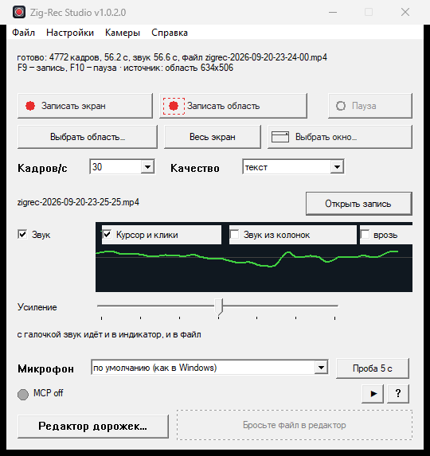

<div align="center">

# Zig-Rec Studio — iVideon

**Форк [Zig-Rec Studio](https://github.com/j0k/ZigRec-Studio) с поддержкой облачных камер Ivideon.**

</div>

<div align="center">
  
</div>

К экранной записи добавлен источник — **живая камера Ivideon** (проверено на Ivideon **Cute 2**).
Камеру можно смотреть в окне и писать в тот же H.264 mp4, что и экран, и открывать в редакторе.

## Что нового

| | |
|---|---|
| **Меню «Камеры → Камера iVideon»** | сведения о камере (имя, онлайн, разрешение, кодек) и выбор: смотреть в окне или записать в файл (с диалогом «куда сохранить») |
| **Меню «Камеры → Документация iVideon…»** | открывает `docs/ivideon-developer-docs.pdf` — как устроен протокол Ivideon (реверс приложения `com.ivideon.client`) |
| **Команда `zigrec camera`** | `zigrec camera <id>` — окно просмотра; `zigrec camera <id> out.mp4 --sec N` — запись |
| **Двойной клик по `zigrec.exe`** | открывает окно (GUI), а не справку |

## Как устроено

Живое видео Ivideon — это **FLV поверх HTTPS** (H.264 + AAC), URL подписывается парой `cseq`/`cs`.
Полностью — в `docs/` (и в PDF).

- `src/net/ivideon.zig` — токен из `.ivideon/token.json`, подписанный URL потока (с юнит-тестами подписи).
- `src/capture/camera.zig` — источник кадров: ffmpeg декодирует FLV→BGRA, отдаёт `capture_types.Frame`
  (тот же тип, что у экранных бэкендов DXGI/GDI — поэтому запись идёт их же кодировщиком).
- `src/app/camera_view.zig` — окно просмотра и запись (`encode.Writer` + `mp4.makeFastStart`).
- `src/app/ui.zig` — меню «Камеры» и диалог.

H.264 в чистом Zig не декодируется, поэтому декодирование делает `ffmpeg` отдельным процессом.
Вход в аккаунт и двухфакторную авторизацию делает `watch_camera.py`, он же сохраняет токен и список камер.

## Быстрый старт

Нужны: [Zig 0.16](https://ziglang.org/download/), Python 3, `ffmpeg` (для декодирования), аккаунт Ivideon.

```
# 1. собрать
zig build -Doptimize=ReleaseFast

# 2. войти в аккаунт (положит токен и список камер в .ivideon/)
python watch_camera.py            # спросит email/пароль; при 2FA — код из SMS:
python watch_camera.py --code 123456

# 3. ffmpeg рядом: положите его в ../tools/ffmpeg/bin/ffmpeg.exe или в PATH

# 4. запустить окно и открыть «Камеры → Камера iVideon»
zig-out\bin\zigrec.exe
```

`.ivideon/` (токены, ключ подписи) — секреты уровня пароля, они в `.gitignore` и в репозиторий не попадают.

## Ограничения

- Декодирование через `ffmpeg` (не нативный Media Foundation — отдельная задача).
- Запись из UI пока запускает дочерний процесс с фиксированной длительностью; интеграция «камера как источник в самом рекордере с F9/стоп» — в работе.
- Проверено на Ivideon Cute 2; другие модели Ivideon должны работать так же (протокол общий).

Базовый функционал экранной записи — в [README.md](README.md).
