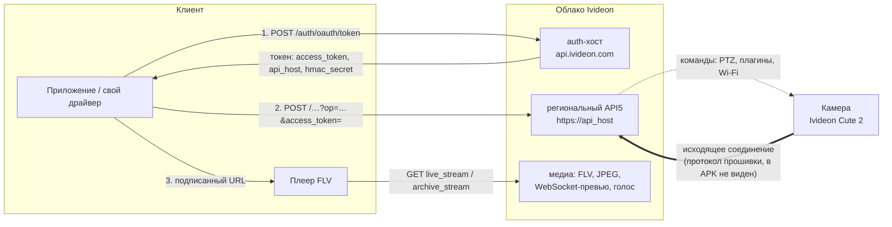

# 2. Архитектура: облако, хосты, устройство приложения

**Теги:** #архитектура #облако #api_host #API5 #хосты #push

## 2.1. Общая схема



Ключевые свойства:

* **Камера сама держит соединение с облаком.** Приложение никогда не обращается к камере напрямую — ни при просмотре, ни при привязке ([09-camera-attachment.md](09-camera-attachment.md)). Команды (PTZ, настройки, скан Wi-Fi) идут в облако, а оно передаёт их камере; отсюда ошибки `CAMERA_OFFLINE`, `DEVICE_TIMED_OUT`.
* **Весь клиентский трафик — HTTPS к облаку**: JSON-API, FLV-видео, JPEG, WebSocket-превью, загрузка голоса.
* **Протокол «камера ↔ облако» находится в прошивке** и из Android-приложения не восстанавливается.

Для драйвера это означает: без облака Ivideon (и без интернета) этим путём картинку не получить. Локальный доступ возможен, только если прошивка Cute 2 сама открывает RTSP/ONVIF/HTTP — это проверяется сканом камеры, а не анализом приложения.

## 2.2. Хосты

Значения по умолчанию — `p000/l21.java:47-51`; логика выбора — `p000/k85.java:47-151`.

| роль | значение по умолчанию | для чего |
|---|---|---|
| **auth** | `https://api.ivideon.com` | `POST /auth/oauth/token`, `POST /idam?op=SHARE` |
| **основной API** | `https://{token.api_host}` | **все авторизованные вызовы**, включая URL видеопотоков и превью |
| public API5 | `https://api.ivideon.com` (или `api5_host` облака `default`) | публичные вызовы: регистрация, сброс пароля, баннеры |
| 2FA | `https://{api5_host}` из ответа-вызова | шаги двухфакторного входа |
| customer clouds | `https://api.ivideon.com` | `POST /customer_clouds?op=FIND` |
| `streaming` | `https://streaming.ivideon.com` | **не используется**: читается один раз и нигде не применяется — наследие старых версий **[вывод]** |
| веб-портал | `https://go.ivideon.com` | ссылки «тариф», «оплата», «помощь»; App Links |

### `api_host` — главный факт

Поле `api_host` из ответа с токеном становится базовым URL Retrofit для основного сервиса (`InterfaceC2236lu`) и сервиса картинок (`InterfaceC2345or`): `p000/yl6.java:28` → `p000/C2199ku.java:48-74`. Если в значении нет схемы, добавляется `https://` (`p000/or7.java:167-171`). **Видеопотоки идут на тот же хост** — отдельного стримингового домена в 3.7.1 нет.

**[проверено]**: `api.ivideon.com` редиректит на `eu01-api.ivideon.com` — вероятно, это и есть типичное значение `api_host` для европейского региона.

Это закрывает вопрос о том, где клиент подставляет `api_host` и когда используется `streaming`.

### Партнёрские облака и on-premise

* `POST https://api.ivideon.com/customer_clouds?op=FIND` — без авторизации и тела; результат — список `{id, id_prefix, id_prefix_range[], geo_host, geo_host_alt, api4_host, api5_host}` (`p000/qm2.java`, `p000/xz1.java`). На экране входа пользователь может выбрать облако; тогда auth-хост = `https://{api4_host}`, public API5 = `https://{api5_host}`. В приложении зашиты бренды `Ivideon` и `Nobelic`.
* «Microcloud» — адрес собственного сервера (`протокол://хост:порт`) вводится вручную и подменяет все хосты.

Обычному пользователю Ivideon ни то ни другое не нужно.

## 2.3. Поколения API

| поколение | признак | статус в 3.7.1 |
|---|---|---|
| **API5** | `?op=`, конверт `{success, result}`, строковые коды ошибок | всё приложение |
| API4 | конверт `{success, response}`, числовые коды, параметр `sessionId` | сервис создаётся и сразу отбрасывается — мёртвый код; остался адаптер ошибок |
| Open API (`openapi-alpha.ivideon.com`) | — | в приложении не используется; публичной документации не найдено (`openapi-docs.ivideon.com` — пустая заглушка) |

## 2.4. Устройство приложения (сетевой слой)

<!-- figure: layers | Слои сетевого стека приложения | replaces-next-code -->

```text
UI (Activity/Fragment/Compose, ViewModel)
   │
   ▼
репозитории            r23 (серверы/камеры), ic0 (вход, 2FA, выход), io1 (Wi-Fi), w03 (привязка) …
   │
   ▼
C2199ku                «сессия API»: создаётся на каждый токен, держит base URL = api_host,
   │                   сервисы InterfaceC2236lu + InterfaceC2345or и интерцептор g58
   ▼
ek6<T> (NetworkCall)   обёртка вызова: статусы, до 3 попыток, сторож 33 с, обновление токена по 401
   │
   ▼
Retrofit 2 + Gson      zn3 — фабрика сервисов; C2619w2 — конверт; C0334eu/C0297du — ошибки
   │
   ▼
OkHttp 5.3.2           i85 — общий клиент, хранитель токена и Gson
```

| класс | роль |
|---|---|
| `p000/i85.java` | ядро SDK: OkHttpClient, Gson, текущий токен, проверка срока, блокировка обновления |
| `p000/k85.java` | сборка `i85`: выбор хостов по режиму (обычный / облако партнёра / microcloud) |
| `p000/yl6.java` | набор сервисов, привязанных к токену; пересоздаётся при смене токена |
| `p000/ob0.java` | хранение токена (SharedPreferences `PREFSES`/`ACCESS_TOKEN`), состояние «вошёл/вышел» |
| `p000/ic0.java` | сценарии входа, 2FA, выхода, отзыва токена |
| `p000/h85.java` | конечный автомат обновления токена |
| `p000/e21.java` | выполнение вызова: повторы, разбор ошибок, реакция на 401 |
| `p000/cv0.java` | сборщик пакетных запросов |

Полная карта — [11-code-map.md](11-code-map.md).

## 2.5. Прочие каналы приложения

| канал | назначение | нужно драйверу? |
|---|---|---|
| Push: FCM, HMS (Huawei), RuStore | уведомления о событиях; подписка — `POST /push_subscriptions?op=CREATE` | нет — привязано к экосистемам Android; замена — опрос `events?op=FIND` |
| AppMetrica (Яндекс), Firebase Crashlytics/Performance, OK Tracer | аналитика и сбор сбоев | нет |
| ML Kit barcode | сканер наклейки камеры и QR | нет |

### Формат push-уведомлений (справочно)

Data-сообщения; плоская карта строк превращается в JSON (`p000/jrc.java`), `server_id` + `camera_id` склеиваются в id камеры. Событие камеры: `type, event, time, title, description, camera_id, camera_name, preview?, chain_id?` (`p000/nc1.java`). Типы: `motion`, `sound`, `sensor-event`, `thermal`, `network-status` (`camera-online/offline`, `server-online/offline`), `doorbell-call` (`started/finished`), `analytics-{line-crossing, area-invasion, tampering, loitering, object-removal}`, а также `face-recognized`, `marketing`, `billing`, `system` (`camera-shared`, `camera-archive-export-completed`, `timelapse-export-completed`). Эти же имена — ориентир для значений `type` в `events?op=FIND` **[гипотеза: там имена иерархические, через `/`]**.

## 2.6. Манифест (кратко)

`minSdk` 29, `targetSdk` 35, `allowBackup=false`. Deep links: `ivideon://start`, `ivideon://signin`; App Links `https://go.ivideon.com/live/`, `/archive/`, `/camera-settings/` объявлены, но Activity не читают `getData()` — фактически не работают **[вывод]**. Экраны отладки (`DebugSettingsController`, `ConfigurationController`) присутствуют в релизной сборке; через них, в частности, переопределяются хосты (SharedPreferences `ApiServerUrls`).
