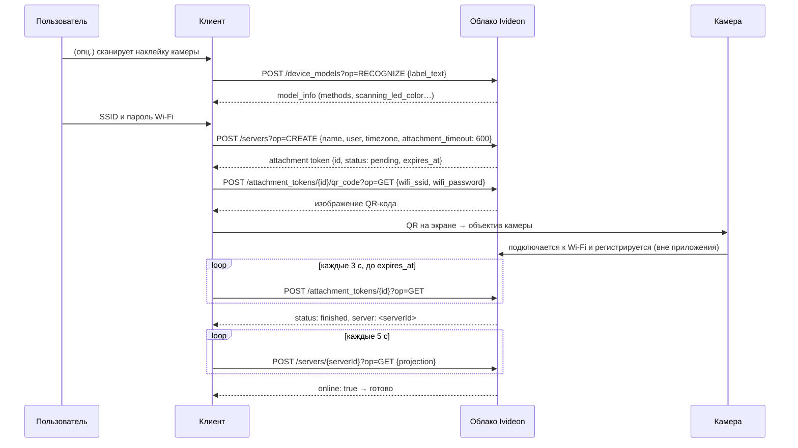

# 9. Привязка камеры к аккаунту

**Теги:** #привязка_камеры #QR #WiFi #Cute2 #облако

Как мастер подключения (`com.ivideon.client.ui.wizard`) добавляет камеру. Главный вывод: **приложение вообще не общается с камерой по локальной сети** — вся привязка идёт через облачный API, а данные Wi-Fi камера получает, считывая объективом QR-код с экрана телефона.

Достоверность: последовательность вызовов и поля — **[код]**. Содержимое QR-кода и то, как камера сама регистрируется в облаке, из APK **не определить** — это логика сервера и прошивки.

Порядок экранов описан в `resources/res/navigation/device_connection_wizard.xml` и `camera_wifi_reconnection_flow.xml`.

## 9.1. Способы привязки

Какие способы доступны конкретной модели, решает сервер (`model_info.methods`, см. 9.3). Enum способов — `p000/ia0.java:19-22`: `qr`, `wps`, `mac`, `sn`.

| способ | состояние в приложении | реализация |
|---|---|---|
| **QR-код на экране телефона → объектив камеры** (`qr`) | реализован; основной для Wi-Fi-камер | фрагменты `com/ivideon/client/p009ui/wizard/methods/p010qr/*`, ViewModel `p000/ls8.java`, `p000/js8.java` |
| **Серийный номер** (`sn`) / **MAC** (`mac`), камера на Ethernet | реализован | `…/wizard/methods/wired/*`, ViewModel `p000/a5a.java` |
| Перевод уже привязанной камеры с Ethernet на Wi-Fi | реализован, запускается после привязки | `…/wizard/methods/wifi/*`, `p000/ui1.java`, `p000/io1.java` |
| ПК/веб-камера через Ivideon Server | только экраны-инструкции | `…/wizard/methods/desktop/*` |
| WPS | только значение enum, нигде не используется | — |
| Точка доступа камеры (AP mode), Bluetooth, звук | **отсутствуют** | см. 9.6 |

## 9.2. Привязка по QR — последовательность



### Шаг 1. Создание токена привязки

Отдельного «создать» у `/attachment_tokens` нет — токен возвращает `POST /servers?op=CREATE` (`p000/InterfaceC2236lu.java:91`; тело `p000/gl2.java`, сборка `p000/w03.java:75-79`).

| поле запроса | тип | значение |
|---|---|---|
| `name` | string | `"<vendorName> <modelAlias>"`, по умолчанию `"Camera"` (`p000/m13.java:66-77`) |
| `user` | string | `owner_id` из OAuth-токена строкой |
| `device_id` | string \| null | для QR — `null`; для проводной привязки — серийный номер или MAC |
| `device_id_type` | `"mac"` \| `"serial_number"` \| null | `p000/u13.java` |
| `timezone` | string | IANA-зона телефона (`ZoneId.systemDefault().getId()`) |
| `attachment_timeout` | int, секунды | `600` (`p000/w03.java:17,76`) |

Ответ — токен привязки (`p000/ja0.java`):

| поле | тип | примечание |
|---|---|---|
| `id` | string | id токена |
| `status` | `pending` \| `finished` \| `timed_out` | `p000/ka0.java` |
| `expires_at` | дата | крайний срок опроса |
| `server` | string \| null | id сервера; появляется при `finished` |
| `owner` | string | |
| `text_template` | string | приложение его **не читает**. **[гипотеза]**: шаблон текстового содержимого QR. Стоит посмотреть в живом ответе |

### Шаг 2. Получение QR-кода

```http
POST /attachment_tokens/{tokenId}/qr_code?op=GET
{"wifi_ssid": "<SSID>", "wifi_password": "<пароль>"}
```

Ответ — **картинка** (приложение делает `BitmapFactory.decodeStream(body.byteStream())`; вызов — в недекомпилированном `invokeSuspend` класса `p000/C2711yj.java`, запускается из `p000/js8.java:167`). Телефон QR **не генерирует** — поэтому формат полезной нагрузки из APK узнать нельзя; надо декодировать реальный QR.

> **Пароль Wi-Fi уходит на сервер Ivideon** в открытом виде внутри HTTPS-запроса — это свойство протокола, а не ошибка клиента.

**Особенность Cute 2** (`p000/es0.java:16-24`): для `model_id` из набора `cute-2`, `Ivideon-Cute-2`, `cute-360`, `Ivideon-Cute-360` приложение **запрещает символ `&`** в пароле и в имени сети, введённом вручную. **[вывод]**: парсер QR в этих камерах считает `&` разделителем полей, то есть полезная нагрузка, вероятно, имеет вид `ключ=значение&…`. Если в пароле вашей сети есть `&`, привязка Cute 2 по QR не сработает.

### Шаг 3. Ожидание (`p000/q91.java`, `p000/p91.java`)

1. **Опрос токена** — `POST /attachment_tokens/{id}?op=GET` каждые **3 с**, общий таймаут `expires_at − now`. Сетевые ошибки логируются, опрос продолжается; `ATTACHMENT_TOKEN_NOT_FOUND` прерывает. Статус не `finished` к концу срока → состояние `Timeout`.
2. **Опрос сервера** — `POST /servers/{serverId}?op=GET` каждые **5 с** с проекцией по ключам `id, owner, connected, online, name, device_type, cameras{…}, software_version, available_updates, device_model, vendor, needs_credentials` (`p000/r23.java:99`). Собственного таймаута у этого цикла нет.
3. Если `needs_credentials: true` — приложение спрашивает логин/пароль устройства и шлёт `POST /servers/{serverId}/auth_credentials?op=UPDATE {"username","password"}` (актуально для сторонних камер, не для Cute 2 **[вывод]**). Ошибка — `BAD_DEVICE_CREDENTIALS`.
4. **Успех**: `server.online` и первая камера сервера `online` (`p000/C2138j7.java:275-281`).

<!-- figure: attachment-states | Состояния мастера привязки -->

### Отмена

`p000/C2175k7.java:442-490`: если токен уже `finished` — удаляется сервер (`POST /servers/{id}?op=DELETE`); иначе — токен: `POST /attachment_tokens/{id}?op=DELETE {"fail_if_finished": false}` (`p000/rw2.java`).

### Коды ошибок сценария

`ATTACHMENT_TOKEN_NOT_FOUND`, `TOKEN_FINISHED`, `SUBJECT_RIGHT_MISSING_FOR_ATTACHMENT_TOKEN`, `SUBJECT_RIGHT_REVOKED_FOR_ATTACHMENT_TOKEN`, `UNRECOGNIZED_FORMAT`, `UNSUPPORTED_DEVICE`, `BAD_DEVICE_CREDENTIALS`, `DEVICE_TIMED_OUT`, `SERVER_OFFLINE` (маппинг — `p000/C0297du.java:19`). Общая модель ошибок — в [10-errors.md](10-errors.md).

## 9.3. Распознавание модели по наклейке

```http
POST /device_models?op=RECOGNIZE          # публичный (@mn6) — токен не добавляется
{"label_text": "<сырая строка из штрих-/QR-кода на наклейке камеры>"}
```

Ответ (`p000/w13.java`, `p000/w96.java`, `p000/v13.java`):

| путь | тип |
|---|---|
| `model_info.vendor_id`, `vendor_name`, `model_id`, `model_alias` | string |
| `model_info.methods` | массив из `qr`, `wps`, `mac`, `sn` |
| `model_info.logo_url` | string \| null |
| `model_info.scanning_led_color` | `red`, `orange`, `yellow`, `green`, `blue`, `indigo`, `violet`, `white`, `gray` — цвет мигающего светодиода, когда камера готова читать QR (`p000/hl5.java`) |
| `device_info.serial_number`, `device_info.mac` | string \| null |

Логика выбора (`p000/nb8.java:159-192`): `qr` в `methods` → беспроводной сценарий; `sn` + серийный номер → проводной по серийнику; иначе `mac` + MAC → проводной по MAC. Если возможны оба — пользователь выбирает. Ошибки: `UNRECOGNIZED_FORMAT`, `UNSUPPORTED_DEVICE`.

Локального каталога моделей в приложении нет — все данные о моделях приходят отсюда.

## 9.4. Проводная привязка

Тот же `POST /servers?op=CREATE`, но `device_id` = серийный номер или MAC и соответствующий `device_id_type` (`p000/a5a.java:84-96`). Пользователь перезагружает камеру по питанию с подключённым Ethernet; дальше — тот же опрос, что в 9.2.

## 9.5. Перевод привязанной камеры на Wi-Fi

Только для **уже привязанной и находящейся онлайн** камеры. `serverId` — часть id камеры до `:` (`p000/vqa.java:30-35`); отсюда формат id камеры: `<serverId>:<индекс канала>`.

```http
POST /servers/{serverId}/wifi?op=SCAN                     # без тела; сканирует сама камера
→ {"networks": [{"ssid": "…", "protection": "OPEN"|"WPA2"|"WPA"|"WEP", "signal": <int>}]}

POST /servers/{serverId}/wifi?op=CONNECT
{"ssid": "…", "password": "…", "protection": "OPEN"|"WEP"|"WPA2"}
```

Источники: `p000/lqa.java`, `kqa.java`, `tqa.java`, `wb2.java`, `io1.java:31`. Последовательность (`p000/ui1.java:180-240`, частично декомпилировано — условия цикла приблизительны):

1. `POST /servers/{id}?op=GET` с проекцией `{connected, network_type, wifi:{ssid}}`; `network_type` ∈ `eth`, `wifi`, `mobile`, `unknown`.
2. `CONNECT`.
3. Пауза 5 с, затем тот же `GET` каждые 5 с до `connected && network_type == "wifi" && wifi.ssid == <целевой>`; три подряд «не подключена» → неудача; `SERVER_OFFLINE` → «связь потеряна».

## 9.6. Локальная сеть: что искали и чего нет

Поиск по всему `sources/`: `NsdManager`, `MulticastSocket`, `DatagramSocket`, `DatagramPacket`, `WifiNetworkSpecifier`, `WifiNetworkSuggestion`, классы Bluetooth, `WpsInfo`, `bindProcessToNetwork`, литералы SSDP/mDNS/ONVIF, `rtsp://`, частные IP-адреса — **ноль совпадений** (при этом `WifiManager` находится — в `p000/fx1.java`, то есть поиск рабочий). `java.net.Socket` встречается только во внутренностях OkHttp. В манифесте нет разрешений Bluetooth, `CHANGE_WIFI_MULTICAST_STATE`, `NEARBY_WIFI_DEVICES`. `WifiManager` используется лишь для списка сетей и текущего SSID — к сети камеры приложение не подключается; шаблонов SSID камер нет.

Со стороны приложения вопрос закрыт: **прямого LAN/P2P-канала «телефон — камера» нет**. Открывает ли прошивка Cute 2 какие-то локальные порты (RTSP/ONVIF/HTTP) — отдельный вопрос, решается только сканом самой камеры.

## 9.7. Что из APK узнать нельзя

* содержимое QR-кода и смысл `text_template` — декодировать реальный QR и посмотреть живой ответ `servers?op=CREATE`;
* протокол «камера ↔ облако» — он в прошивке;
* принимает ли Cute 2 привязку по `sn`/`mac` — зависит от ответа `RECOGNIZE` на её наклейку.

## 9.8. Прочие перечисления

* `DeviceType` (`com/ivideon/sdk/network/data/p012v5/DeviceType.java`): `desktop`, `camera`, `dvr`, `doorbell`, `bridge`, `cloud_bridge`, `unknown`.
* Форм-фактор (`p000/yc1.java`, только для UI): `home`, `bullet`, `cupola`.
