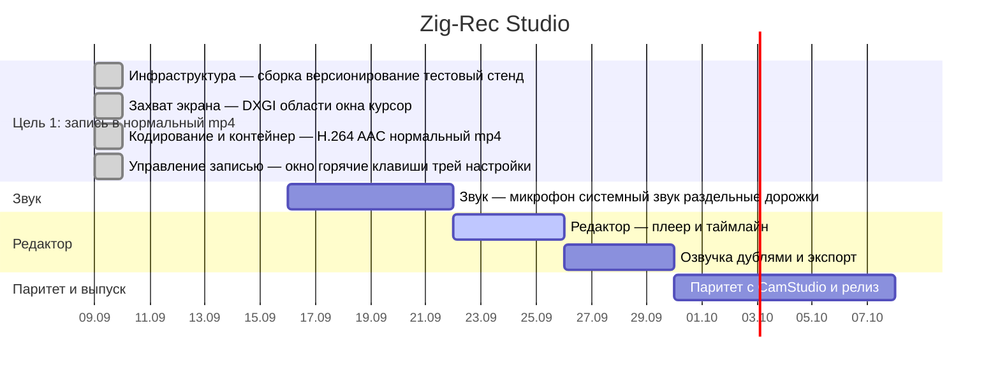

# План работ

Диаграмма собирается из трекера инструментом `tools/gantt.py`, а не рисуется
руками: нарисованная руками устаревает на первой же закрытой задаче и начинает
врать.

**Готово 65.1%** — 28 задач из 43. Обновлено 2026-09-15.

Даты закрытого настоящие. Даты открытого — план, а не обещание: они расставлены
по порядку эпиков, по два дня на оставшуюся задачу.

## Что за чем

**Цель 1** закрыта: запись куска экрана в mp4, который открывается в браузере,
Windows Media Player, VLC и PowerPoint. Четыре эпика — инфраструктура, захват,
кодирование, управление записью.

**Звук** идёт следом, потому что без него запись экрана наполовину немая.
Микрофон уже пишется отдельной дорожкой; остались системный звук и несколько
дорожек в одном файле.

**Редактор** — самая большая часть впереди: плеер с точной перемоткой, таймлайн
с дорожками и отменой, резка, экспорт без перекодирования.

**Паритет и выпуск** в конце: сравнение с CamStudio и OBS по расходу процессора,
размеру и качеству, потом версия 1.0.

Подробности по каждой задаче — в [задачах на GitHub](https://github.com/j0k/ZigRec-Studio/issues).
